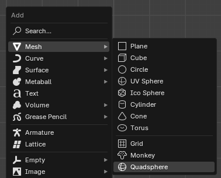

# Quadsphere Addon
**A Blender addon for creating quadspheres with no shading distortions**

## Installation

Can be installed like usual by installing the addons _.zip_ archive through the Blender preferences window.
The addon adds a "Quadsphere" option to the `3D View > Add > Mesh` menu

## Downloads

Download `QuadsphereAddon.zip` from [releases](https://github.com/xDUDSSx/quadsphere-blender-addon/releases).  
Alternatively you can zip the `QuadsphereAddon` folder yourself after cloning the repo.

## Documentation

[User guide and technical explanation (**in czech**)](documentation_czech.adoc)

## Sources

[The addon generates quadspheres using a method described in a youtube video by IanMcGlasham](https://www.youtube.com/watch?v=aRSVYFrRWeU&lc=UgytOrSygRnrgQ5oPzF4AaABAg)
